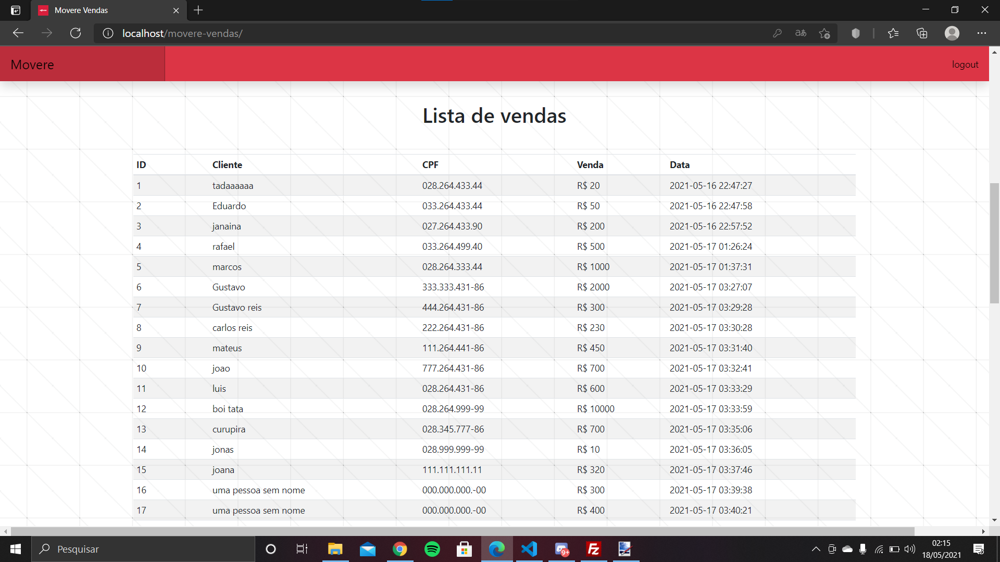
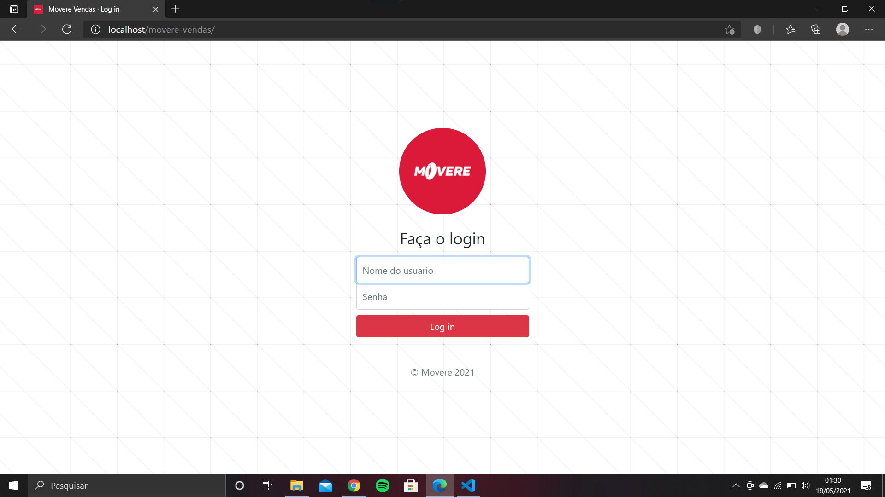
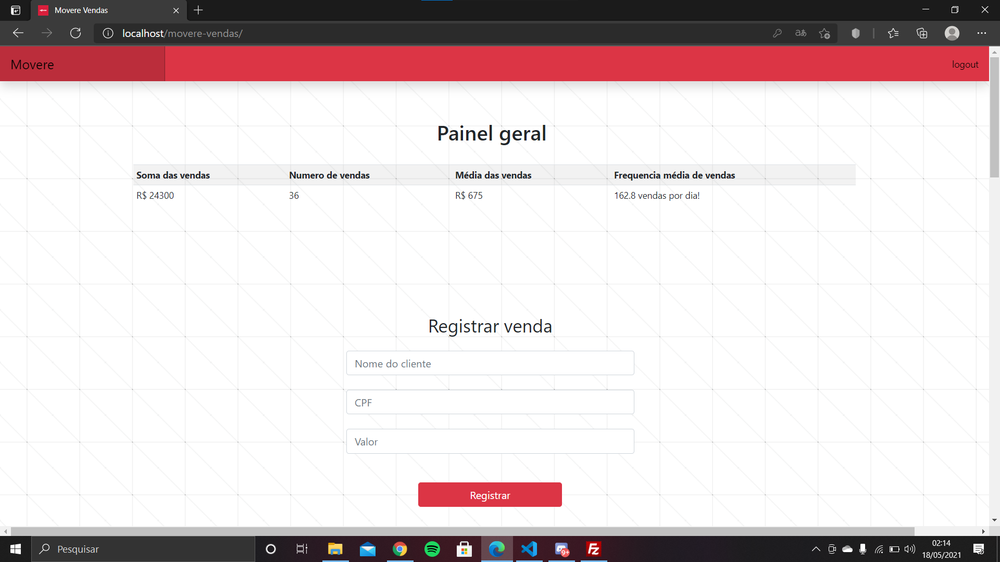
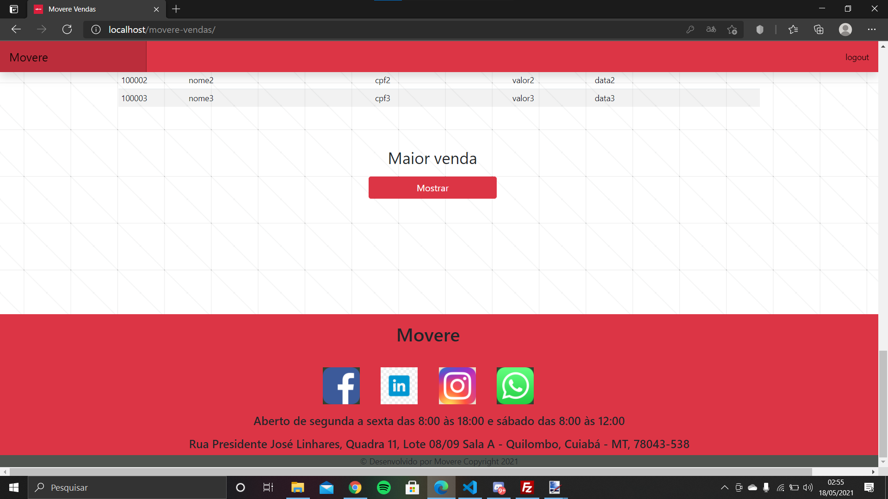
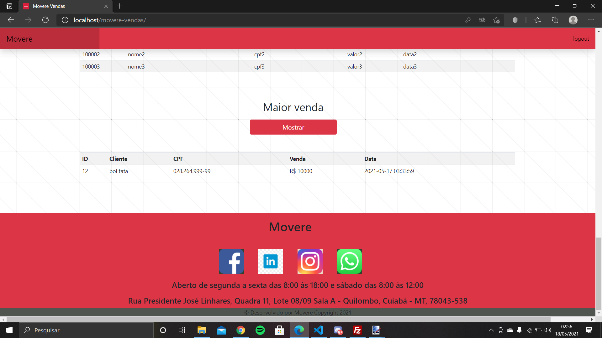

# &emsp;&emsp;&emsp;&nbsp;&emsp;&emsp;&emsp;&emsp;&emsp;&emsp;&nbsp;&emsp;&emsp;&emsp;&emsp;Movere Vendas
**&emsp;&emsp;Uma aplicação web feita para segunda fase do programa de estagio da Movere**

  

## O que é?
Uma aplicação web responsiva e altamente performatica capaz de fazer registro de vendas e exibi-las em uma tabela.

## Objetivo do projeto

Simular o desenvolvimento de um software para um cliente. Comprindo todos os requisitos solicitados na segunda faze do programa de estagio, e alem.

## &emsp;&emsp;&emsp;&nbsp;&emsp;&emsp;&emsp;&nbsp;&emsp;&emsp;&emsp;&nbsp;Screen Shots

* ### tela de login

* ### tela de login apos dados inseridos incorretos

* ### tela principal

* ### tabela de vendas

* ### Botão de maior venda e footer

* ### Botão de maior venda exibindo conteudo

## Recursos:
* Responsividade (funciona em qualquer tela)
* Alta performance e escalabilidade
* Tela de login
* Tela principal
* botão de logout
* Painel geral mostrando principais informações
* Formulario de cadastro
* Tabela das vendas registradas
* Botão que mostra maior venda
* footer com informações da empresa e links para contato
* Registra o nome, CPF, valor e a data de uma venda.  
* Mostra ID, nome, CPF,e data exata de cada venda. 
* Mostra numero de vendas
* Mostra valor da soma de todas as vendas
* Mostra media de valor das vendas
* Mostra frequencia media de vendas por dia. (baseado sempre no ultimo cadastro (variação de tempo entre ultimo cadastro e primeiro cadastro dividido pelo numero de vendas.))

## Manual do usuario

1. De qualquer computador, ou celular com qualquer sistema operacional abra o navegador e acesse o link: https://www.dasistnichtbereit.com/movere-vendas/
2. Ao abrir a pagina de login digite o nome de usuaria e senha fornecida pela empresa
3. Ao entrar na tela principal vera um painel exibindo as principais informações, e abaixo um formulario para cadastro.
4. Digite o nome, cpf e o valor da venda nos campos exibidos.
5. Clique em registrar e pronto!
6. O valor no painel sera atualizado e as informações da venda serão exibidas na tabela abaixo.
7. Se essa venda for a maior venda realizada ao clicar no botão Mostrar abaixo de Maior venda, abaixo da tabela, sera exibida as infirmações registradas da maior venda. 
8. Se quiser voltar rapidamente para o inicio da pagina (pode ser nescessario com uma tabela muito grande), clique em movere no canto superior esquerdo da tela.
9. Para entrar em contato com a empresa clique em um dos icones das redes sociais no final da pagina, e sera redirecionado para a rede social selecionada da empresa. 
10. Se preferir contato presencial, a localização e horarios de funcionamento da empresa, estão localizadas no final da pagina no footer abaixo dos icones das redes sociais.

## Requisitos para implementação local

* Ter o Xampp instalado

## Requisitos para implementação na Web

* Ter o Xampp instalado (opcional)
* Ter o Filezilla instalado (opcional)
* Ter sum serviço de hospedagem
* Ter um dominio

## Como implementar localmente

* Baixar a pasta deste repositorio via git push ou pela interface grafica do GitHub

* Baixar o programa Xampp que pode ser encontrado neste link: https://www.apachefriends.org/pt_br/index.html

* Instalar o Xampp
* observar atentamente onde a pasta xampp sera instalada no computador
* Abrir o xamp e dar um start no apache e no Mysql

* Vá até a pasta xampp instalada no sistema, e vá até a pasta htdocs
* Dentro da pasta htdocs ponha a pasta baixada deste repositorio
* abra o navegador e digite localhost/phpmyadmin/
* Va na aba importar
* dentro da pasta baixada desde repositorio va até a pasta "sql banco de dados"
* desntro desta pasta, arraste o arquivo .sql para o phpmyadmin no navegador, para exportar o banco de dados de teste
* Pronto!! agora é só digitar no seu navegador "localhost/movere-vendas/"

## Como implementar na Web

* Entre no painel do seu serviço de hospedagem
 
* Importe o banco de dados como foi feito localmente
 
* Na pasta config.php mude os valores das constantes para os valores do seu banco de dados fornecidas pelo seu serviço de hospedagem.
 
* Se tiver a aplicação implementada localmente, voce pode usar o filezilla para exportar seus arquivos e dados. 

## Informações adicionais

&emsp;&emsp;Este projeto foi desenvolvido em HTML, CSS, JS, Bootstrap, PHP, e SQl. Para ter alta performace e alta escalabilidade, escolhi não usar nenhum framework como Meteor ou React. Escolhi também não incluir mais recursos adicionais como cadastrar cliente e produtos, já que teoricamente o cliente só teria pedido uma aplicação para registrar as vendas e um botão para mostrar a maior venda, e esta aplicação ja contem significamete mais recursos. Escolhi alta performance e escalabilidade para poder reaproveitar o codigo futuramente para outras aplicações, ou atualização, ou evolução da mesma.

&emsp;&emsp;**IMPORTANTE!!** cuidado na hora de implementar na web, pois localmente tudo funcionou perfeitamente, mas na hora de implementar na web muito problemas ocorreram, e muitas mudanças foram necessarias para adaptar ao meu serviço de hospedagem.
